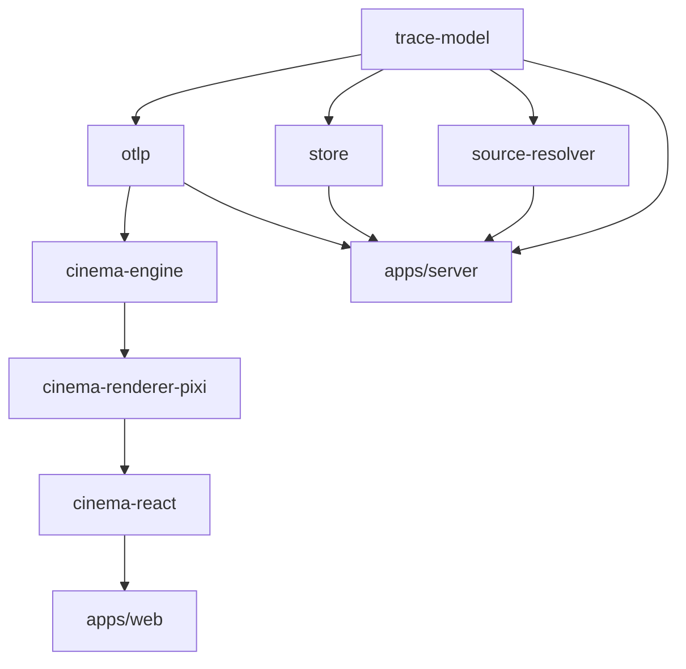

# 🎬 Request Cinema

<div align="center">

[](https://github.com/almaskhan/request-cinema/actions/workflows/ci.yml)
[](https://opensource.org/licenses/MIT)
[](https://www.typescriptlang.org/)
[](https://nodejs.org/)
[](https://opentelemetry.io/)
[](CONTRIBUTING.md)

**Turn distributed OpenTelemetry traces into high-speed trains navigating a living architecture metro map.**  
*Slow spans glow red. Click any station or train to jump straight to git blame, commit history, and the exact lines of code.*

[Quick Start](#-quick-start) • [Live Demo](#-live-demo) • [Architecture](#-architecture) • [Comparison](#-comparison) • [Contributing](CONTRIBUTING.md)

</div>

---

## 🌟 Why Request Cinema?

Traditional distributed trace viewers (like Jaeger and Zipkin) give you horizontal waterfall Gantt charts. While informative, waterfall charts obscure the **real topological journey** of a request hopping across microservices, database clusters, cache layers, and message brokers.

**Request Cinema** re-imagines distributed observability:
- 🗺️ **Automatic Architecture Metro Map**: Synthesizes clean topological transit maps directly from OTLP trace graphs.
- 🚄 **Train Physics & Real-Time Flow**: Spans travel along transit lines at time-scaled speeds. Parallel spans run concurrently as distinct trains.
- 🔥 **Relative Heat Profiling**: Spans glow along a color ramp according to their historical percentile distribution ($p50$, $p90$, $p99$).
- 🔍 **One-Click Source & Git Blame**: Clicking any span highlights the exact source code file, function, and recent Git commits.
- ⚡ **Zero-Server In-Browser Mode**: Drag-and-drop OTLP JSON or Jaeger dumps directly into your browser with client-side execution.
- 🔒 **Privacy-First Redaction**: PII, credit cards, and authorization tokens are redacted by default before reaching storage.

```
       [ Client Gateway ]
               │ (HTTP /orders)
               ▼
       ╔═════════════════╗
       ║   Order API     ║ ───(pub: order.created)───► [ Kafka Queue ]
       ╚═════════════════╝                                   │
               │                                             │ (sub)
               ├──────────────┐                              ▼
               ▼              ▼                    ╔═══════════════════╗
         [ PostgreSQL ] [ Payment Service ]        ║ Fulfillment Worker║
               ▲              │                    ╚═══════════════════╝
               │         (Stripe API)                        │
          (Slow Query         │                              ▼
           Glows Red!)        ▼                         [ Inventory DB ]
                         [ Third-Party ]
```

---

## ⚡ Quick Start

### 1. Prerequisites
- **Node.js**: `v22.0.0` or newer (LTS recommended)
- **pnpm**: `v9.0.0` or newer

### 2. Clone & Run Locally
```bash
# Clone the repository
git clone https://github.com/almaskhan/request-cinema.git
cd request-cinema

# Install dependencies
pnpm install

# Start the development server (API, Web, and live mock trace stream)
pnpm dev
```

Open **`http://localhost:5173`** to watch traces stream across the metro canvas.

### 3. Docker Compose (Single Command)
```bash
docker compose up -d
```
Navigate to `http://localhost:3000` to access the full production build with the embedded ingest server.

---

## 📊 Comparison: Request Cinema vs Legacy Visualizers

| Feature | Request Cinema | Jaeger / Zipkin | Grafana Tempo / APM |
| :--- | :---: | :---: | :---: |
| **Mental Model** | 🚇 Living Metro Architecture Map | 📊 Horizontal Gantt Chart | 📈 Flamegraph / Tree |
| **Animation & Flow** | 🚄 Real-time & Scrubbable Trains | ❌ Static Snapshot | ❌ Static Snapshot |
| **Bottleneck Visibility** | 🔥 Relative Percentile Heatmap | ⚠️ Text Duration | ⏱️ Absolute Color Bands |
| **Source Code Inspection**| 💻 Integrated File & Git Blame | ❌ External Link Only | ❌ Requires 3rd-party APM |
| **Client-Only Demo** | 🌐 Yes (Runs in pure browser memory) | ❌ Requires daemon | ❌ Requires object storage |
| **Clock Skew Repair** | 🛠️ Automatic Topological Correction| ⚠️ Partial / Unadjusted | ⚠️ Manual Skew Offsets |
| **Cycle & Orphan Repair**| 🔄 Synthetic Root Healing | ❌ Fragmented Traces | ❌ Fragmented Traces |

---

## 🏗️ Architecture

Request Cinema follows strict hexagonal isolation across pnpm workspaces:



- **`packages/trace-model`**: Pure Zod schemas and branded IDs (`TraceId`, `SpanId`).
- **`packages/otlp`**: High-throughput protobuf & JSON decoder, clock-skew corrector, and PII redactor.
- **`packages/cinema-engine`**: Pure deterministic engine (`(trace, layout, t) => SceneState`). No DOM, no Node, fully reproducible.
- **`packages/cinema-renderer-pixi`**: WebGL/Canvas hardware-accelerated renderer with LOD optimization.
- **`packages/cinema-react`**: Ergonomic React 19 wrapper component and custom hooks.
- **`packages/store`**: High-performance SQLite (`node:sqlite` WAL mode) and in-memory storage adapters.
- **`packages/source-resolver`**: AST analysis via `ts-morph` and Git history / blame extraction.

---

## ⌨️ Keyboard Shortcuts

| Key | Action |
| :--- | :--- |
| <kbd>Space</kbd> | Play / Pause animation |
| <kbd>→</kbd> / <kbd>←</kbd> | Step forward / backward by span |
| <kbd>+</kbd> / <kbd>-</kbd> | Increase / decrease playback speed (0.25x – 8x) |
| <kbd>F</kbd> | Follow active request camera |
| <kbd>T</kbd> | Toggle accessible table view |
| <kbd>/</kbd> | Focus trace search filter |
| <kbd>?</kbd> | Show keyboard shortcut cheat-sheet |

---

## 🛡️ Security & Privacy

Request Cinema is designed to be enterprise-safe:
- **Zero Raw PII Storage**: Attributes pass through allowlist and regex sanitizers (scrubbing tokens, passwords, session cookies, and credit cards) prior to persistence.
- **Sandbox Source Resolution**: Filesystem access in `source-resolver` strictly adheres to configured project directory boundaries, blocking directory traversal attacks.
- **No Remote Execution**: AST inspection and Git operations execute read-only queries with strict argument escaping.

---

## 🤝 Contributing

We welcome contributions! Please see [CONTRIBUTING.md](CONTRIBUTING.md) for full instructions on local development, testing standards, and Conventional Commits.

---

## 📄 License

Licensed under the [MIT License](LICENSE).
