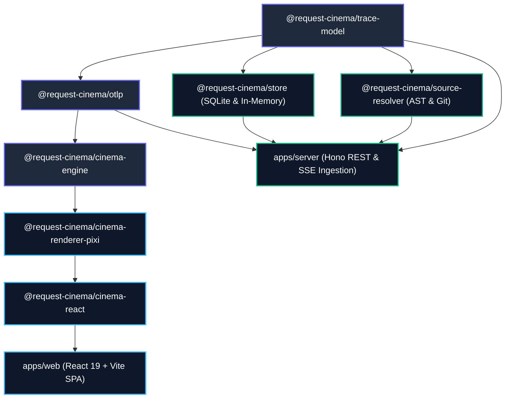

# 🎬 Request Cinema

<div align="center">

[](https://github.com/almas-codes/request-cinema/actions/workflows/ci.yml)
[](https://opensource.org/licenses/MIT)
[](https://www.typescriptlang.org/)
[](https://nodejs.org/)
[](https://opentelemetry.io/)
[](CONTRIBUTING.md)

### *Turn complicated backend logs into an animated subway map you can play, pause, and rewind like a movie.*

[Simple Explanation](#-what-is-request-cinema-in-simple-words) • [Quick Start](#-quick-start-in-30-seconds) • [How It Works](#-the-subway-map-explained) • [Features](#-key-features) • [Comparison](#-comparison-with-other-tools) • [Architecture](#-architecture--monorepo) • [Contributing](CONTRIBUTING.md)

</div>

---

## 🧐 What is Request Cinema? (In Simple Words)

When someone clicks a button on an app or website (for example, clicking **"Pay Now"** on an online store), that single request travels across many different background computers:
1. It hits the **API Gateway** (the front door).
2. It talks to the **Authentication Service** (checking who you are).
3. It asks the **Database** (checking your cart and inventory).
4. It calls a **Payment Processor** (charging your card).
5. It sends a message to an **Email Worker** (sending your receipt).

### The Problem:
When something goes wrong or takes 10 seconds to load, engineers normally have to stare at **thousands of lines of confusing text logs** or **ugly horizontal bar charts** (called waterfall traces). It is hard to read, hard to understand, and takes forever to figure out which server is broken.

### The Solution:
**Request Cinema turns your entire system into an animated Metro / Subway transit map:**
- 🚉 **Stations** = Your servers, databases, and APIs (Node, Go, Python, PostgreSQL, Redis, Kafka).
- 🛤️ **Railway Tracks** = The network connections between them.
- 🚄 **Trains** = The user's request traveling from one server to another.
- 🟢🟡🔴 **Speed & Colors** = Fast servers stay cool green/blue. If a database is slow, it turns bright glowing red!
- 💥 **Train Crash / Derailment** = If a server throws an error (like a 500 error or crash), the train physically derails with sparks and smoke right at that station. You instantly know who broke it.
- 🔍 **Click to See Code** = Click on any station or train to immediately see the exact file and lines of code that ran.

You can **Play**, **Pause**, **Slow Down**, or **Scrub backward and forward** just like a video on YouTube or Netflix.

---

## 🚇 The Subway Map Explained

Here is what your system looks like inside Request Cinema:

```text
                           [ USER CLICKS "CHECKOUT" ]
                                       │
                                       │ (Train departs)
                                       ▼
                             ┌───────────────────┐
                             │    API Gateway    │ (Central Station)
                             └─────────┬─────────┘
                                       │
                        ┌──────────────┴──────────────┐
                        │ (Parallel train)            │ (Parallel train)
                        ▼                             ▼
             ┌───────────────────┐         ┌─────────────────────┐
             │   Order Service   │         │    Auth Service     │
             └─────────┬─────────┘         └──────────┬──────────┘
                       │                              │
         ┌─────────────┴─────────────┐                │ (Quick stop)
         ▼                           ▼                ▼
    ┌──────────────┐     ┌──────────────────────┐ ┌─────────┐
    │ Postgres DB  │     │   Kafka Event Bus    │ │  Redis  │
    └──────────────┘     └───────────┬──────────┘ └─────────┘
      (Slow query?                   │
     station turns red)              ▼
                         ┌──────────────────────┐
                         │  Notification Worker │
                         └──────────────────────┘
```

When you hit **Play**, you watch the request leave the user's browser, travel down the tracks, split into child requests, wait for database queries, and return an answer. 

---

## ⚡ Quick Start in 30 Seconds

You don't need any complex setup or cloud accounts. It runs 100% locally on your machine.

### Option 1: Run the Interactive Web Player (No Backend Required)

```bash
# 1. Clone this repository
git clone https://github.com/almas-codes/request-cinema.git
cd request-cinema

# 2. Install dependencies
pnpm install

# 3. Start the visual player
pnpm --filter @request-cinema/web dev
```

1. Open **`http://localhost:5173`** in your browser.
2. Click any of the built-in scenario buttons at the top to try it out:
   - 🛒 **E-Commerce Checkout**: Watch a standard shopping checkout complete across 5 microservices.
   - 🔍 **Parallel Product Search**: Watch 1 request fan out into 10 parallel search queries.
   - ⚡ **Retry Storm**: Watch a database query fail, retry with exponential backoff, and recover.
   - 📬 **Async Queue Pipeline**: Watch an event hop onto a message queue and get picked up by background workers.
3. You can also drag and drop your own **OpenTelemetry (OTLP) JSON trace file** directly into the browser to visualize your own app!

---

### Option 2: Full-Stack Mode (Send Live Data from Your Own Apps)

If you want to send live telemetry directly from your own backend applications:

```bash
# Starts both the backend receiver (port 3001) and web UI (port 5173)
pnpm dev
```

- **Web Visualizer**: `http://localhost:5173`
- **OTLP Ingestion Endpoint**: `http://localhost:3001/v1/traces`
- **Documentation**: `http://localhost:4321`

#### Test sending a trace with curl:
```bash
curl -X POST http://localhost:3001/v1/traces \
  -H "Content-Type: application/json" \
  -d @examples/trace-fixtures/node-express-otlp.json
```
Watch the train immediately depart across the subway map on your screen via live Server-Sent Events (SSE)!

---

### Option 3: Run with Docker Compose

If you prefer Docker:

```bash
docker compose up --build
```
Open **`http://localhost:3000`** to see everything running with demo microservices generating real background traffic.

---

## 🎮 Key Features

### 1. ⏯️ Movie-Style Timeline Scrubber
- **Play & Pause**: Smooth 60 frames-per-second animation powered by PixiJS WebGL.
- **Scrubbing**: Drag the slider to any exact millisecond in the request lifecycle ($t = 150\text{ms}$).
- **Speed Up or Slow Down**: Play in slow-motion ($0.25\times$) to inspect microsecond race conditions, or fast-forward at $8\times$.

### 2. 🌡️ Relative Latency Heatmap
Not all slow requests are the same. A 200ms database query might be normal, but a 200ms cache lookup is terrible.
- 🟢 **Cool Teal / Blue**: Running at normal speed (healthy).
- 🟡 **Warm Amber**: Slower than usual (degraded).
- 🔴 **Bright Neon Crimson**: Major bottleneck ($p99$ slowest requests).

### 3. 💥 Train Derailment on Errors
When a service crashes or returns an HTTP 500 error, the train doesn't just show a tiny red warning icon—it physically derails with sparks and smoke right at the offending service station, making root causes impossible to miss.

### 4. 🧑‍💻 Click to See Code & Git Blame
Clicking on any station or train opens the **Inspector Panel**:
- **Attributes**: View all request metadata (headers, SQL queries, user IDs).
- **Privacy by Default**: Passwords, API tokens, session cookies, and credit card numbers are automatically scrubbed and redacted.
- **Source Code**: Shows you the exact file name and highlighted line numbers in your codebase that executed the request.
- **Git History**: Shows the commit hash, author, and commit message for that specific line of code.

### 5. ♿ Accessible Table View (<kbd>T</kbd>)
Press the <kbd>T</kbd> key at any time to switch between the animated subway map and a clean, high-contrast, screen-reader friendly table view that meets WCAG 2.2 AA accessibility standards.

---

## ⌨️ Keyboard Shortcuts

| Key | What it does |
| :--- | :--- |
| <kbd>Space</kbd> | Play / Pause playback |
| <kbd>→</kbd> / <kbd>←</kbd> | Step forward / backward by 50ms |
| <kbd>+</kbd> / <kbd>-</kbd> | Speed up / slow down playback |
| <kbd>T</kbd> | Switch between Subway Map and Accessible Table View |
| <kbd>C</kbd> or <kbd>?</kbd> | Show Keyboard Shortcuts popup |
| <kbd>Esc</kbd> | Close inspector panel or modal |

---

## 📊 Comparison with Other Tools

| Feature | Request Cinema | Jaeger / Zipkin | Grafana Tempo / Datadog |
| :--- | :---: | :---: | :---: |
| **How it looks** | 🚇 Animated Subway Metro Map | 📊 Horizontal Gantt Bars | 📈 Flamegraph / Tree |
| **Animation** | 🚄 Interactive Video Player | ❌ Static image | ❌ Static image |
| **Finding Bottlenecks** | 🔥 Stations glow red automatically | ⚠️ Have to read millisecond numbers | ⏱️ Bar lengths |
| **Error Visibility** | 💥 Physical train crash animation | ⚠️ Small red dot on bar | ⚠️ Small error badge |
| **View Source Code** | 💻 Integrated file & Git blame | ❌ Not available | ⚠️ Requires 3rd-party APM link |
| **Zero-Server Browser Mode** | 🌐 Yes (Drop any JSON file and play) | ❌ Requires server daemon | ❌ Requires cloud storage |
| **Industry Standard** | ✅ Standard OpenTelemetry (OTLP) | ✅ OTLP | ✅ OTLP |
| **Best Used For** | **Incident debugging, onboarding new devs, visual demos, explaining architecture** | Raw log search and historical audits | Multi-petabyte enterprise telemetry |

---

## 🏗️ Architecture & Monorepo

Request Cinema is built with **TypeScript**, **Turborepo**, and **pnpm workspaces**:



### Monorepo Packages:
- **`packages/trace-model`**: Clean Zod schemas and TypeScript types for traces, spans, and attributes.
- **`packages/otlp`**: Universal decoder and normalizer for standard OpenTelemetry OTLP JSON payloads. Works in both Node and browsers.
- **`packages/cinema-engine`**: Pure deterministic simulation engine. Calculates positions, layout, clock skew corrections, and timeline state.
- **`packages/cinema-renderer-pixi`**: High-performance 60fps WebGL canvas renderer using PixiJS.
- **`packages/cinema-react`**: React components and hooks (`useClock`, `useSceneState`) for embedding the player.
- **`packages/source-resolver`**: Maps spans back to local Git repositories, files, and lines using AST parsing.
- **`packages/store`**: Storage layer supporting in-memory and SQLite (WAL mode).
- **`apps/web`**: The main frontend visualizer application (React 19, Vite, Tailwind CSS, Zustand).
- **`apps/server`**: Lightweight ingestion server built with Hono and Server-Sent Events (SSE).
- **`apps/docs`**: Documentation site built with Astro Starlight.

---

## 🔒 Security & Privacy

- **Automatic Secret Redaction**: All trace attributes automatically filter and mask passwords, JWT tokens, API keys, emails, cookies, and credit cards before saving or rendering.
- **Safe Source Resolution**: File lookups strictly enforce project root boundaries and reject directory traversal attacks (e.g. `../../etc/passwd`).
- **Open Standards**: Built entirely on standard OpenTelemetry (OTLP). No proprietary agents, no hidden SDKs, and no tracking.

---

## 🧪 Testing & Code Quality

You can run the entire test and quality suite with one command:

```bash
pnpm verify
```

This automatically runs:
- **Biome Check**: Lints and formats 129 source files.
- **Dependency Boundary Cruiser**: Asserts zero circular dependencies across packages.
- **TypeScript**: Full monorepo typecheck via `tsc --build`.
- **Vitest Unit Tests**: All 42 tests passing across 9 test suites.
- **Fast-Check Property Fuzzing**: Validates that randomized malformed traces never crash the engine.
- **Build**: Compiles all packages and bundles the web application.

---

## 🤝 Contributing

Contributions are very welcome! Whether it's adding a new sample scenario, improving transit map layout algorithms, or enhancing docs:

1. Fork the repo and clone it locally.
2. Read [CONTRIBUTING.md](CONTRIBUTING.md).
3. Verify your changes pass `pnpm verify`.
4. Submit a Pull Request with a clear description!

---

## 📄 License

Request Cinema is open-source software licensed under the **[MIT License](LICENSE)**.

<div align="center">
Built with ❤️ for developers who want to understand their backend systems with clarity and joy.
</div>
